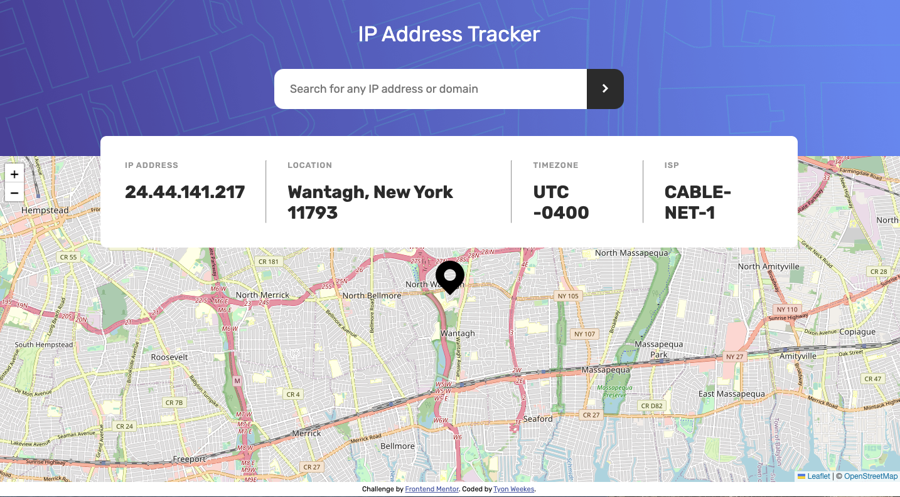

# Frontend Mentor - IP address tracker solution

This is a solution to the [IP address tracker challenge on Frontend Mentor](https://www.frontendmentor.io/challenges/ip-address-tracker-I8-0yYAH0). Frontend Mentor challenges help you improve your coding skills by building realistic projects. 

## Table of contents

- [Overview](#overview)
  - [The challenge](#the-challenge)
  - [Screenshot](#screenshot)
  - [Links](#links)
- [My process](#my-process)
  - [Built with](#built-with)
  - [What I learned](#what-i-learned)
  - [Continued development](#continued-development)
  - [Useful resources](#useful-resources)
- [Author](#author)
- [Acknowledgments](#acknowledgments)

**Note: Delete this note and update the table of contents based on what sections you keep.**

## Overview

### The challenge

Users should be able to:

- View the optimal layout for each page depending on their device's screen size
- See hover states for all interactive elements on the page
- See their own IP address on the map on the initial page load
- Search for any IP addresses or domains and see the key information and location

### Screenshot

### Links

- Solution URL: [IP Address Tracker](https://playful-croissant-725587.netlify.app)

## My process

### Built with

- Semantic HTML5 markup
- CSS custom properties
- Flexbox
- Mobile-first workflow
- [Leaflet.js](https://leafletjs.com/) - JS library
- [ipapi](https://ipapi.co/) - IP API

### What I learned

I learned more about integrating an API into a site, as well as how to add a JS library.

### Continued development

I would like to continue practicing JavaScript.

## Author

- Website - [Tyon Weekes](https://www.tyonweekes.com)

**Note: Delete this note and add/remove/edit lines above based on what links you'd like to share.**

## Acknowledgments

Thanks to Siphiwo Julayi's YouTube video for helping me figure out how to use fetch with an IP API. Also thanks to Himanshu Tegyalwar's solution for an alternate IP API, when the suggested one was not working for me.
